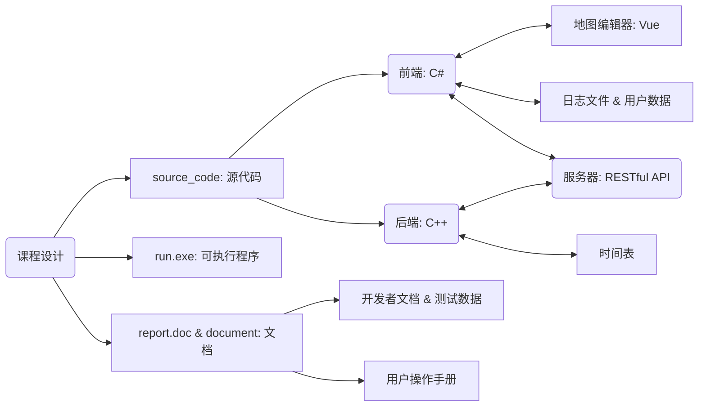
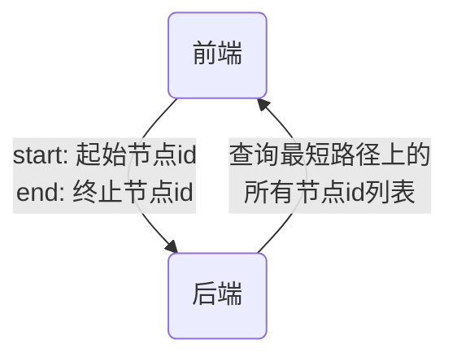
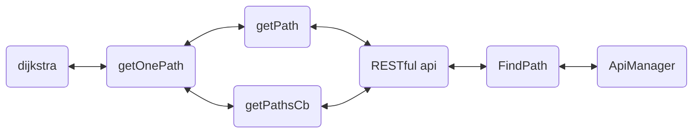

# 数据结构课程设计报告

## 组员

| 姓名  | 学号         |
| --- | ---------- |
| 张梓靖 | 2019211379 |
| 毛子恒 | 2019211397 |
| 姜山  | 2019211402 |

## 目录

[TOC]

## 设计任务的描述

### 问题描述

校园中有众多的建筑物和道路，且学校有多个校区（**至少 2 个**）；某位同学于某一时刻向系统提出导航要求，系统根据该同学的要求为其设计一条线路并输出；系统能查询当前时刻同学所处的地点和周围的教学楼、宿舍楼、餐饮、后勤服务、操场等信息。

### 设计任务

设计并实现一个具有查询导航功能的校园导览系统。

## 功能需求说明及分析

### 需求说明

* 校园内建筑物（教学楼、办公楼、宿舍楼）数不少于 20 个，其它服务设施不少于 5 种，共 20 个
* 建立校园内部道路图，可以采用学校地图
  * 包括各种建筑物、服务设施等信息
  * 边数大于 200 条
  * 校区个数至少 2 个
* 学生发出起点、终点请求，给出导航策略。
  * 起点和终点可以是物理位置，也可以是逻辑位置
  * 逻辑位置可以和物理位置一对一
  * 起点和终点可以在不同校区，需要考虑校区间的交通
    方式，**定时**或者**间隔一定时间**有校车发出
* 实现四种导航策略：
  * 最短距离策略：距离最短即可
  * 最短时间策略：假设每条道路**拥挤度**不一样，在这种情况下时间最短即可

    > 拥挤度为$ \le 1 $的正数
    > $ 真实速度 \times 拥挤度 = 理想速度$，拥挤度与理想速度自拟

  * 途径最短距离策略：途径某些地点的最短距离
  * 交通工具的最短时间策略：
    * 可选自行车道路，默认自行车在校区任何地点都有
    * 这时在考虑不同拥挤度的情况下时间最短；
* 模拟导航系统以时间为轴向前推移，系统时间**精确到分钟**
* 建立日志文件，对学生状态变化和键入等信息进行记录
* 学生选定路线后，按照路线和设定好的行进速度行进
* 学生可以实时查询自己所处的位置
  * 能够查询周围的建筑物
  * 给出一定范围内的建筑（自拟范围），标出到这些目标的距离最短路线的距离
  * 选定某一个目标给出当前位置到目标的距离最短路线

---

选做部分：

* 中途停止：中途更改目标和导航策略，系统按照当前位置做相应的操作
* 图形化界面：用图形绘制地图，并在地图上进行实时导航
* 绘制建筑内部：在教学楼和宿舍楼中进行导航，能够导航到具体的楼层和房间
* 负载均衡：根据食堂人流量进行负载均衡导航
* 多用户的系统：实时查询任一用户状态

### 需求分析

* [x] 图形界面采用学校地图，满足地图要求（PS等方法合成）
* [x] 后端导入地图并初始化，编码最短路径算法，形成可供前端调用的RESTful接口
* [x] 前端需要在地图上标记，形成地图数据并导入到后端
* [x] 前端储存逻辑位置，导入课程表
* [x] 动态显示用户位置，暂停可查询周边建筑
* [x] 前端把操作写入日志文件
* [x] 前端处理逻辑位置查询、附近的建筑物查询
* [x] 后端实现静态或动态的负载均衡算法

### 输入输出

| 输入内容        | 输入操作                          |
| ----------- | ----------------------------- |
| 起点终点选择      | 先点击选点，之后直接点击地图，或点击坐标框输入逻辑地址搜索 |
| 移动方式选择      | 点击移动方式选项，选择步行或自行车             |
| 跨校区策略选择     | 点击跨校区策略选项，选择公交、校车或出租车         |
| 出发时间选择      | 依次在出发时间选项，输入时、分信息             |
| 寻路策略选择      | 点击寻路策略选项，选择时间优先或距离优先          |
| 速度倍率和时间流逝选择 | 调节速度倍率和时间流逝选项                 |
| 步行速度和骑行速度选择 | 在步行速度和骑行速度选项，输入步行速度和骑行速度      |
| 查看路线按键      | 以现在选择的起点、终点和寻路策略给出最优寻路方案      |
| 开始模拟按键      | 开始模拟导航过程                      |
| 功能菜单附近按键    | 输入搜索半径，搜索附近的位置，按照由近及远依次排序显示   |
| 登录界面用户名密码   | 输入用户名密码登录                     |

| 输出内容     | 输出操作                                     |
| -------- | ---------------------------------------- |
| 预估时间     | 选择起点和终点，点击查看路线输出                         |
| 导航路线     | 点击查看路线，在地图上显示导航路线                        |
| 逻辑地址搜索   | 选点时点击坐标框，可以解析地址字符串，对逻辑地址进行搜索，并定位到教学楼内部地图 |
| 负载均衡推荐食堂 | 搜索逻辑地址时输入食堂，可以按负载均衡算法进行最优推荐              |
| 附近位置搜索   | 按照输入的半径对当前子图上周围的地图节点进行搜索，并按照距离排序输出       |

### 数据管理

| 数据           | 存储方式   | 操作方式                     |
| -------------- | ---------- | ---------------------------- |
| 地图背景图片   | 上传至图床 | 修改背景图片`url`            |
| 地图所有点集合 | `json`文件 | 通过地图修改器导出`json`文件 |
| 日志文件       | `log`文件  | 前端文件修改                 |
| 时间表         | `txt`文件  | 后端文件修改                 |
| 用户信息       | `json`文件 | 开发者修改，前端文件读取     |
| 配置信息       | `json`文件 | 开发者修改                   |

### 故障处理

| 错误类型       | 处理方法 | 处理端 |
| ---------- | ---- | --- |
| 未选择起始点或终止点 | 窗口提示 | 前端  |
| 未显示路径就开始导航 | 窗口提示 | 前端  |
| 起点和终点相同    | 窗口提示 | 前端  |
| 不存在可用的路径   | 窗口提示 | 后端  |

## 总体方案设计说明

### 实现方法

* 采用C/S架构
* 前端编码：Vue（地图编辑器） & C#（模拟导航）
* 后端编码：C++
* 交互：RESTful API
* 文档：Markdown

### 总体结构



### 模块划分

#### 后端模块划分

* 导入地图数据模块
  * 从服务器存储的`json`格式的文件导入，读取文件流，并构建地图的节点和边等数据结构，初始化地图对象的拥挤度等。
* 查询导航策略路径模块
  * 最短路径策略：通过最短路算法（$Dijkstra$、$A Star / A*$）实现传入起始节点和终止接点，返回一条距离最短的路径。
* 最短时间策略：与最短路径策略类似，新加入了**拥挤度**的概念，由于$速度 \times 时间 = 路程 $，也即$ 时间 = \frac{路程}{速度} $，故可以用现有的路程和速度直接求出时间。拥挤度是在地图初始化的时候随机赋值的，所以不妨直接初始化为速度的倒数，从而变为路程的系数。从而每条路径的距离乘系数可得到当前的时间距离（即用经过路径所花费的时间来表示的距离）。可以直接使用最短路径策略的算法，或者针对其不符合欧式二维向量空间的特性加以改进。
  * 途径最短距离策略：仍旧可以转化为最短路径策略，在起始节点与终止节点直接加入途经节点，即可形成起始节点到途径节点、途径节点到终止节点两条最短路径。
  
* 交通工具的路径策略：在自行车道已经在地图上确定的情况下，计算路线时绕过不支持自行车的道路，同时将速度放大以符合实际情况。

* 获取导航路径预计时间模块
  * 存储不同交通工具的时间表
  * 设计子图内部和跨子图的不同情况，分别有以下几种情况：

    ```json
    {
        "Default": 0,
        "Bicycle": 1,
        "Car": 2,
        "Bus": 4, // 用于跨校区
        "Subway": 8, // 用于跨校区
        "EnterBuilding": 16, // 用于主图到建筑内，建筑内之间
        "ExitBuilding": 32, // 用于主图到建筑内，建筑内之间
        "DownStair": 64, // 用于主图到建筑内，建筑内之间
        "UpStair": 128 // 用于主图到建筑内，建筑内之间
    }
    ```
    
  * 根据不同情况，计算导航路径预计时间
* 查询周边建筑模块
  * 对周边一定距离范围的节点进行搜索，并返回当前查询结果
* RESTful API
  * 使用`restbed`编码RESTful规范的接口，将导航查询结果通过`json`格式返回给前端

#### 前端模块划分

* 地图编辑器模块
  * 实现从键盘和鼠标读入，在地图上标记的功能
    * 标记的节点和边可以修改和删除
    * 分配给节点`id`值，采用递增式的`snowflake`雪花算法实现，得到13位`id`数字字符串
    * 用不同颜色区分不同边的类型，如：普通道路、自行车道等
  * 实现存入`json`格式的地图数据，批量导入节点和边
  * 实现导出`json`格式的地图数据，并可存入缓存和清空缓存
  * 实现通过更改`localStorage`中背景图片url，修改标注地图
* 绘制建筑内部模块
  * 实现点击建筑物进入内部的功能，并可以绘制建筑物内部地图
* 导航策略模块：
  * 实现四种不同导航策略的查询
  * 实现逻辑地址（可建筑物内部）的查询
  * 实现周围建筑物的查询
* 多用户模块
  * 实现用户界面
  * 实现用户信息存储
  * 实现用户逻辑时间表（课程表）存储和读取
* 逻辑位置存储和查询模块
  * 导入逻辑位置数据（课程表）
  * 实现逻辑位置查询，实现逻辑位置间导航
* 查询周边位置模块
  * 在导航系统暂停后，按照输入的范围搜索
  * 排序显示范围内的子图内部节点
* 计时器模块
  * 实现计时器模块，显示当前时间（精确到分钟）
  * 动态显示用户在地图上所在位置
  * 实现随时暂停，并可进行后续操作的功能
* 食堂负载均衡
  * 根据食堂当前人数比例，实现动态负载均衡算法，显示排序后结果。

## 数据结构说明和数据字典

### 数据结构说明

* 二维向量`Vector2D`

  | 成员  | 变量类型  | 意义      |
  | --- | ----- | ------- |
  | `X` | `int` | 二维向量横坐标 |
  | `Y` | `int` | 二维向量纵坐标 |

* 地图的抽象节点类`Node`

  | 成员          | 变量类型                 | 意义       |
  | ----------- | -------------------- | -------- |
  | `id`        | `unsigned long long` | 节点的唯一id值 |
  | `getType()` | 函数返回值`bool`          | 获取节点类型   |

* 地图的内部节点类`MapNode`

  | 成员          | 变量类型        | 意义                      |
  | ----------- | ----------- | ----------------------- |
  | `mapId`     | `int`       | 节点的唯一id值                |
  | `name`      | `string`    | 节点的命名                   |
  | `position`  | `Vector2D`  | 节点的坐标，以二维向量形式储存         |
  | `speed`     | `int`       | 节点的速度                   |
  | `getType()` | 函数返回值`bool` | 获取节点类型`true`代表`MapNode` |

* 地图的边界节点类`PortNode`

  | 成员          | 变量类型                 | 意义                        |
  | ----------- | -------------------- | ------------------------- |
  | `level`     | `int`                | 节点级别                      |
  | `stMapId`   | `unsigned long long` | 起始点的`MapId`               |
  | `edMapId`   | `unsigned long long` | 终止点的`MapId`               |
  | `stNodeId`  | `unsigned long long` | 起始点的`NodeId`              |
  | `edNodeId`  | `unsigned long long` | 终止点的`NodeId`              |
  | `getType()` | 函数返回值`bool`          | 获取节点类型`false`代表`PortNode` |

* 地图的边类`EdgeNode`

  | 成员       | 变量类型                 | 意义         |
  | -------- | -------------------- | ---------- |
  | `id`     | `unsigned long long` | 边的唯一id值    |
  | `start`  | `int`                | 边的起始点      |
  | `dest`   | `int`                | 边的终止点      |
  | `length` | `int`                | 边的权，代表路径长度 |
  | `speed`  | `int`                | 边的速度       |
  | `level`  | `int`                | 边的级别       |

### 类对象说明

* 地图类`Graph`私有成员变量

  | 成员             | 变量类型                       | 意义                  |
  | -------------- | -------------------------- | ------------------- |
  | `vertex_count` | `int`                      | 地图总的节点个数            |
  | `nodes`        | `vector<MapNode>`          | 地图的所有内部节点           |
  | `edges`        | `vector<vector<EdgeNode>>` | 地图的所有边，以**邻接表**形式储存 |
  | `ports`        | `vector<PortNode>`         | 地图的所有边界节点           |
  | `scale`        | `double`                   | 缩放比例                |
  | `lastTime`     | `int`                      | 上一次随机速度的时间          |
  | `avgSpeed`     | `int`                      | 平均速度                |

* 地图类`Graph`公共成员函数

  | 成员                                                                                                       | 函数功能                |
  | -------------------------------------------------------------------------------------------------------- | ------------------- |
  | `void loadMap(int nodeNum, const std::vector<MapNode> &nodeData, const std::vector<EdgeData> &edgeData)` | 预加载地图内部节点           |
  | `void loadPort(const std::vector<PortNode> &portData, double scale)`                                     | 预加载地图边界节点           |
  | `const std::vector<MapNode> &getNodes() const`                                                           | 获取所有节点              |
  | `const std::vector<std::vector<EdgeNode>> &getEdges() const`                                             | 获取所有边               |
  | `int getDis(const Vector2D &u, const Vector2D &v) const`                                                 | 获取两点间欧氏距离           |
  | `void setSpeed(int time)`                                                                                | 用时间种子随机化速度（**拥挤度**） |
  | `int dijkstra(int st, int ed, Path &solution, bool isRandom, bool isBike) const`                         | 迪杰斯特拉最短路算法          |

### 文件数据结构说明

如前所述，子图内部和跨子图有多个不同的情况，我们将其编号为2的整数次幂。在之后的文件中，一般是`level`字段，我们可以通过一个掩码表示一个道路或者边界节点有多种通行方式。

```json
{
    "Default": 0,
    "Bicycle": 1,
    "Car": 2,
    "Bus": 4, // 用于跨校区
    "Subway": 8, // 用于跨校区
    "EnterBuilding": 16, // 用于主图到建筑内，建筑内之间
    "ExitBuilding": 32, // 用于主图到建筑内，建筑内之间
    "DownStair": 64, // 用于主图到建筑内，建筑内之间
    "UpStair": 128 // 用于主图到建筑内，建筑内之间
}
```

例如，如果一个边界节点（即跨校区的节点）`level`字段为12，表示该节点可以采用公交车或者地铁的方式通行。

* 地图子图和边界节点文件`port.json`例：

  ```json
  {
      "maps": [
          {
              "id": 0,
              "scale": 1.0, // 地图比例尺
              "name": "校区 0",
              "path": "map_0.json",// 路径文件
              "bgimg": "map_0.png" // 背景图片
          }
      ],
      "ports": [
          {
              "id": 1,
              "level": 12,
              "sourceMapId": 1,			   // 起点所在子图id
              "targetMapId": 0,			   // 终点所在子图id
              "sourceNodeId": 1621873253982, // 起点id
              "targetNodeId": 1621872829538  // 终点id
          }
      ]
  }
  ```
  
* 地图内部节点和边文件`map.json`等（由地图编辑器生成）例：

  ```json
  {
      "elements": {
          "nodes": [
              {
                  "data": {
                      "id": 1621872829538,
                      "title": "东1门",
                      "subtitle": ""
                  },
                  "position": {
                      "x": 585.3797361211376,
                      "y": 53.04161691813325
                  },
                  "group": "nodes",
                  "removed": false,
                  "selected": false,
                  "selectable": true,
                  "locked": false,
                  "grabbable": true,
                  "pannable": false,
                  "classes": ""
              }
          ],
          "edges": [
              {
                  "data": {
                      "id": 1622026312362,
                      "source": 1622026312276,
                      "target": 1622026312277,
                      "level": 1,
                      "virtual": 0
                  },
                  "group": "edges",
                  "removed": false,
                  "selected": false,
                  "selectable": true,
                  "locked": false,
                  "grabbable": true,
                  "pannable": true,
                  "classes": ""
              }
          ]
      }
  }
  ```
  
* 用户数据文件`user.json`例：

  ```json
  {
      "zzj": {
          "Username": "zzj", // 用户名
          "Password": "111111", // 密码
          "AddressMapper": { // 逻辑地址列表（课程表）
              "List": [
                  {
                      "DayOfWeek": [ // 周二
                          2
                      ],
                      "TimeStart": 28800, // 上课开始时间
                      "TimeEnd": 34500, // 上课结束时间
                      "Class": "2019211308", // 班级
                      "Activity": "计算机网络", // 课程名
                      "_MapId": 2, // 子图id
                      "_NodeId": 1622021008611 // 节点id
                  },
                  {
                      "DayOfWeek": [
                          3
                      ],
                      "TimeStart": 28800,
                      "TimeEnd": 34500,
                      "Class": "2019211308",
                      "Activity": "数据结构",
                      "_MapId": 2,
                      "_NodeId": 1622021008612
                  }
              ]
          }
      }
  }
  ```

- 配置文件`settings.json`例：

    ```json
    {
        "DebugMode": false,
        "BaseUrl": "http://123.57.244.239:1926/", // 后端程序地址
        "RebootUrl": "http://123.57.244.239:8999/" // 重启后端地址
    }
    ```

* 日志文件`.log`例：

  * 进入程序

  ```
  2021-06-03 16:37:33.524 +08:00 [INF] Entering program...
  ```
  
  * 选点
  
  ```
  2021-06-03 16:41:47.926 +08:00 [DBG] Click on Point(468,245.56) id = 1621873253990
  ```
  
  * 打开子图（教学楼内部）

  ```
  2021-06-03 17:51:08.695 +08:00 [INF] Open Map 2
  ```
  
  * 开始导航
  
  ```
  2021-06-04 07:27:26.553 +08:00 [INF] Finding Path from: Node(Id = 1621873253984, MapId = 1, Location = 650, 316, Title = null), to: Node(Id = 1622021008611, MapId = 2, Location = 198, 330, Title = B2F1 教室-2)
  ```
  
  * 模拟开始
  
  ```
  2021-06-04 12:33:28.636 +08:00 [INF] Start simulation.
  ```

  * 模拟结束
  
  ```
  2021-06-04 12:33:04.204 +08:00 [INF] Finish simulation.
  ```
  
  * 输出当前位置到日志
  
  ```
  2021-06-04 12:33:28.656 +08:00 [INF] Current location: (507.88774178974234, 364.72179487023107)
  ```

### 接口说明

RESTful接口举例图示：



**注**：以下接口说明格式

`[GET] /xxx?p1=v1` 表示请求方法 `[GET]`，路径 `/xxx`，参数 `p1` 值为 `v1`

* `[GET] /map_meta` 获取地图元数据

  此接口返回`port.json`文件的部分内容。
  
  返回格式举例：

```json
{
    "maps": [
        0,
        1,
        2,
        3
    ],
    "ports": [
        {
            "id": 1,
            "level": 12, // Subway + Bus = 4 + 8 = 12
            "sourceMapId": 0,
            "targetMapId": 1,
            "sourceNodeId": 1621873253982,
            "targetNodeId": 1621872829538
        },
        {
            "id": 2,
            "level": 12,
            "sourceMapId": 1,
            "targetMapId": 0,
            "sourceNodeId": 1621872829538,
            "targetNodeId": 1621873253982
        }
    ]
}
```

* `[GET] /map/:id` 获取地图数据

  此接口返回某个地图`json`文件的部分内容。
  
  返回格式举例：

```json
{
    "elements": {
        "nodes": [ // 节点数据结构
            {
                "data": {
                    "id": "6802523324657176576",
                    "title": "", // 节点名
                    "subtitle": ""
                },
                "position": { // 节点坐标，以像素为单位
                    "x": 144,
                    "y": 483
                },
            }
        ],
        "edges": [ // 边数据结构
            {
                "data": {
                    "id": "6802523515032440832",
                    "source": "6802523392281939968", // 起点id
                    "target": "6802523482799214592", // 终点id
                    "level": 0 // 如果为1，表示非自行车道
                }
                "group": "edges", // 以下是不重要的系统生成项
                "removed": false,
                "selected": true,
                "selectable": true,
                "locked": false,
                "grabbable": true,
                "pannable": true,
                "classes": ""
            }
        ]
    }
}
```

* `[GET] /path?`

  * source_node_id = xxx
  * target_node_id = xxx
  * source_map_id = xxx
  * target_mop_id = xxx
  * type = 1               // 路径规划类型 1 最短距离 2 最短时间 3 自行车最短时间
  * depart_at = 1231
  * cross_type = 1         // 如果跨校区，选择通勤类型 level

  获取一条路径。
  
  此接口仅用于获取没有途经点的路线，已弃用。
  
  返回格式距离：

```json
{
   "id": 1,
   "time": 89,
   "path": [
       {
           "type": "node",
           "id": 123,
           "mapId": 1,
       },
       {
           "type": "node",
           "id": 124,
           "mapId": 1,
       },
       {
           "type": "port",
           "id": 123
       },
       {
           "type": "node",
           "id": 333,
           "mapId": 2,
       },
   ]
}
```

* `[POST] /paths?`

    body格式举例：

```
{
	"nodes": [
		{
			"nodeId": 1622026312271,
			"mapId": 0
		},
		{
			"nodeId": 1621872829547,
			"mapId": 0
		}
	],
	"path_type": 0,
	"prefer_transport_type": 0,
	"depart_at": 43200,
	"cross_type": 8
}
```

​	获取路径。

​	此接口用于获取有途经点的路线。

返回格式举例：

```json
{
   "id": 1,
   "time": 89,
   "path": [
       {
           "type": "node",
           "id": 123,
           "mapId": 1,
       },
       {
           "type": "node",
           "id": 124,
           "mapId": 1,
       },
       {
           "type": "port",
           "id": 123
       },
       {
           "type": "node",
           "id": 333,
           "mapId": 2,
       },
   ]
}
```

## 各模块设计说明

### 算法思想

* **基本思想**：

  * 指定起点 $s$，即从顶点 $s$ 开始计算。
  * 引进两个集合 $S$ 和 $U$ 。

  $S$ ：记录已求出最短路径的顶点（以及相应的最短路径长度）。

  $U$ ：记录还未求出最短路径的顶点（以及该顶点到起点$s$的距离）。

* **算法步骤**：
  1. 初始时，$S$ 只包含起点 $s$ ；$U$ 包含除 $s$ 外的其他顶点，且 $U$ 中顶点的距离为**起点 $s$ 到该顶点的距离**。例如，$U$ 中顶点 $v$ 的距离为 $(s,v)$ 的长度，然后 $s$ 和 $v$ 不相邻，则 $v$ 的距离为 $\\infin$。
  2. 从 $U$ 中选出**距离最短的顶点 $k$ **，并将顶点 $k$ 加入到 $S$ 中；同时，从 $U$ 中移除顶点 $k$ 。
  3. 更新 $U$ 中各个顶点到起点 $s$ 的距离。之所以更新 $U$ 中顶点的距离，是由于上一步中确定了 $k$ 是求出最短路径的顶点，从而可以利用 $k$ 来更新其它顶点的距离；例如， $(s,v)$ 的距离可能大于 $(s,k)+(k,v)$ 的距离。
  4. 重复步骤 2 和 3 ，直到遍历完所有顶点。

### 算法

#### Dijkstra

* 最初的$Dijkstra$算法不采用优先队列，时间复杂度是$O(n^3)$。

  这是因为在每次从为求出最短路径的定点集合中取出距离虽短的顶点，都需要遍历一遍与其相邻的顶点，时间复杂度为$O(n)$。

* 通过优先队列（堆）实现的$Dijkstra$算法时间复杂度是$O(n^2 \log n)$。

  改进之处正是由于优先队列（堆）只需要从堆顶取出距离最小的顶点即可，获取堆顶元素的时间复杂度为$O(1)$，堆顶元素移除后，维护堆的时间复杂度为$O(\log{n})$，故时间复杂度整体优化至$O(n^2\log{n})$。
  
  核心算法代码如下：

```cpp
void Graph::dijkstra(int st, int ed, Path &solution) const
{
    priority_queue<pair<int, int>, vector<pair<int, int>>, greater<pair<int, int>>> q;
    unique_ptr<int[]> dis(new int[vertexCount]);
    unique_ptr<int[]> lastVertex(new int[vertexCount]);
    for (int i = 0; i < vertexCount; ++i)
    {
        dis[i] = INF;
        lastVertex[i] = -1;
    }
    dis[st] = 0;
    q.push(make_pair(0, st));
    while (!q.empty())
    {
        int u = q.top().second;
        q.pop();
        for (auto edge:edges[u])
        {
            if (dis[edge.dest] > dis[u] + edge.length)
            {
                dis[edge.dest] = dis[u] + edge.length;
                lastVertex[edge.dest] = u;
                q.push(make_pair(dis[edge.dest], edge.dest));
            }
        }
    }
    int temp = ed;
    while (~temp)
    {
        solution.push_back(nodes[temp]);
        temp = lastVertex[temp];
    }
    reverse(solution.begin(), solution.end());
}
```

#### A Star（A*）

$A*$算法（$A Star$）算法是一种静态路网中求解最短路最有效的方法，可以看做是$Dijkstra$算法的优化。

公式表示为：$f(n)=g(n)+h(n)$，其中$f(n)$是从初始点经由节点$n$到目标点的估价函数，$g(n)$是在状态空间中从初始节点到$n$节点的实际代价，$h(n)$是从$n$到目标节点最佳路径的估计代价。

核心算法代码如下：

```cpp
void Graph::Astar(int st, int ed, Path &solution) const
{
    priority_queue<pair<int, int>, vector<pair<int, int>>, greater<pair<int, int>>> q;
    unique_ptr<int[]> dis(new int[vertexCount]());
    unique_ptr<const EdgeNode * []> lastEdge(new const EdgeNode * [vertexCount]);
    unique_ptr<bool[]> inOpen(new bool[vertexCount]());
    unique_ptr<bool[]> inClose(new bool[vertexCount]());
    for (int i = 0; i < vertexCount; ++i)
    {
        lastEdge[i] = nullptr;
        inOpen[i] = inClose[i] = false;
    }
    inOpen[st] = true;
    q.push(make_pair(cal_distance(nodes[st], nodes[ed]), st));
    while (!q.empty())
    {
        auto u = q.top().second;
        if (u == ed)break;
        q.pop();
        if (inClose[u])continue;
        inClose[u] = true;
        for (const auto &edge:edges[u])
        {
            if (inClose[edge.dest])continue;
            if (!inOpen[edge.dest])
            {
                dis[edge.dest] = dis[u] + edge.length;
                lastEdge[edge.dest] = &edge;
                q.push(make_pair(dis[edge.dest] + cal_distance(nodes[edge.dest], nodes[ed]), edge.dest));
                inOpen[edge.dest] = true;
            }
            else
            {
                if (dis[edge.dest] > dis[u] + edge.length)
                {
                    dis[edge.dest] = dis[u] + edge.length;
                    lastEdge[edge.dest] = &edge;
                    q.push(make_pair(dis[edge.dest] + cal_distance(nodes[edge.dest], nodes[ed]), edge.dest));
                }
            }
        }
    }
    while (lastEdge[ed])
    {
        solution.push_back(lastEdge[ed]->id);
        ed = lastEdge[ed]->start;
    }
    reverse(solution.begin(), solution.end());
}
```

### 算法比较与讨论


我们实现过的两种算法的特点：

1. $Dijkstra$算法计算源点到其他所有点的最短路径长度，$A*$关注点到点的最短路径（包括具体路径）。 

2. $Dijkstra$算法建立在较为抽象的图论层面，$A*$算法可以更轻松地用在诸如游戏地图寻路中。 

3. $Dijkstra$算法的实质是广度优先搜索，是一种发散式的搜索，所以空间复杂度和时间复杂度都比较高。对路径上的当前点，$A*$算法不但记录其到源点的代价，还计算当前点到目标点的期望代价，是一种启发式算法，也可以认为是一种深度优先的算法。 

4. 由第一点，当目标点很多时，$A*$算法会带入大量重复数据和复杂的估价函数，所以如果不要求获得具体路径而只比较路径长度时，$Dijkstra$算法会成为更好的选择。 

5. **最重要**的一点，这也是我们后来不采用$A*$算法反而采用$Dijkstra$算法的原因：采用欧氏距离作为预估函数的$A*$算法不适用于非欧平面！如果是求最短路径问题，$A*$算法无疑是可行的；但是在最短时间问题上不可行，因为地图拥挤度是随机的，并且还有步行和自行车之分，我们不能保证通过路径的时间能代替路径的距离作为边权，还能够形成一个非欧平面。如果不能保证是非欧平面，那么$A*$算法在某些情况下，预估函数将引起极大的误导作用，产生的结果将会是错误的。而堆优化$Dijkstra$算法虽然在某些时候效率不如$A*$算法，但结果总是正确的。在效率和正确性的抉择中，我们最终还是选择了算法的正确性。

    例如，在如上的平面中，假设考虑拥挤度之后，st和ed点之间的直线距离时10000，而这个直角三角形的两个直角边的长度都为1。估价函数是基于欧氏距离的计算，因此会优先考虑走斜边到达终点，此时得到路径的长度为10000。然而，很明显我们需要走两条直角边到达终点，这时候$A*$算法得出的答案与正确答案偏离极大。

### 跨地图的处理

由于我们将两个校区、教学楼的各个楼层均抽象成地图，因此在导航之前因首先处理出从起点到终点应该经过哪些地图。由于地图的数量十分有限，并且地图间通道的数量也有限，可以采用深度优先搜索的方法，从起点所在地图开始遍历每一个图间通道，直到找到终点所在地图为止。

### 多途经点的处理

当涉及到多个途经点时，按照用户输入的顺序依次经过这些点，即将路径分成一个个单独的起点-终点对，再进行原本的寻路算法。

### 与其他模块的关系



### 拥挤度随机算法

拥挤度采用正态分布的方法随机，同时考虑**时间和空间上的连续性**，具体说明参考8.2节的内容。

## 测试情况说明

### 程序执行结果展示

* 选择起点和终点，选择时间优先策略导航


* 设置自行车道路导航，并可以设置步行和骑车速度


* 可以跨校区导航，预估时间根据出发时间和跨校区策略而定


* 可以输入搜索半径，得到附近建筑物搜索结果


* 可以搜索逻辑位置，定位到教室


* 可以导航到建筑物内部，并模拟进入建筑物内部


### 测试过程解决问题

* 最短路径上的问题

  

  一开始，我们用$Dijkstra$和$A*$两种算法进行了最短路径的搜索。但是随着后续的深入思考，我们发现采用欧氏距离作为预估函数的$A*$算法不适用于非欧平面。

  $A*$算法只能求解最短距离问题，$Dijkstra$则既能求解最短路径，又能求解最短时间。

  因为地图拥挤度是随机的，并且还有步行和自行车之分，我们不能保证通过路径的时间能代替路径的距离作为边权，还能够形成一个非欧平面。如果不能保证是非欧平面，那么$A*$算法在某些情况下，预估函数将引起极大的误导作用，产生的结果将会是错误的。

  而堆优化$Dijkstra$算法虽然在某些时候效率不如$A*$算法，但结果总是正确的。在效率和正确性的抉择中，我们最终还是选择了算法的正确性。

* 关于速度的问题


最终，我们确定为速度的平均值，即`avgSpeed`为$340$，而随机得到的速度值为$(270,340)$之间的正态分布（使用`normal_distribution`和`mt19937`随机数算法实现）。而为了便于计算，我们分别给点和边各加了一个速度。为了使模拟导航时移动速度均匀平滑，保证**空间上的连续性**，我们取边的速度（注意是**有向边**）和点的速度做平均得到当前节点的速度值。

此外，为了保障**时间上的连续性**，程序会记录上一次随机速度的时间，在15分钟内不会随机新的速度。

* 关于文件存储的问题


在项目初期，我们对文件的存储产生了很多想法。由于数据库便于存取结构化数据的特性，一开始，我们想使用SQLite数据库对数据进行存储。而另一种想法是json，他不但适合存取结构化数据，而且轻量易修改。这为我们前期的调试工作带来了不少方便。

* 地图显示问题


前期，我们尝试过一些地图，但是都不满意。最终，我们用图形学算法对地图进行了渲染，才得到了现在的地图。


* 前后端集成测试问题


```
16: Content-Length
Connection: close
Connection: keep-alive
Keep-Alive: timeout=4
Proxy-Connection: keep-alive
```

经过Postman调试，我们发现响应头出错，并进行了及时修改。

```
Access to XMLHttpRequest at 'http://123.57.244.239:1926/setmap' from origin 'http://localhost:8081' has been blocked by CORS policy: Response to preflight request doesn't pass access control check: It does not have HTTP ok status.
```

需要加中间件统一处理所有请求的响应头。

```
Access to XMLHttpRequest at 'http://123.57.244.239:1926/setmap' from origin 'http://localhost:8081' has been blocked by CORS policy: Response to preflight request doesn't pass access control check: It does not have HTTP ok status.
vue.runtime.esm.js:620 [Vue warn]: Error in v-on handler (Promise/async): "Error: Network Error"

found in

---> <MdButton> at src/components/MdButton/MdButton.vue
       <Map> at src/views/map/map.vue
         <MdContent> at src/components/MdContent/MdContent.vue
           <MdAppContent> at src/components/MdApp/MdAppContent.vue
             <MdAppSideDrawer> at src/components/MdApp/MdAppSideDrawer.vue
               <Normal> at src/App.vue
                 <Root>
warn @ vue.runtime.esm.js:620
logError @ vue.runtime.esm.js:1883
globalHandleError @ vue.runtime.esm.js:1878
handleError @ vue.runtime.esm.js:1838
eval @ vue.runtime.esm.js:1855
Promise.catch(异步)

invokeWithErrorHandling @ vue.runtime.esm.js:1855
invoker @ vue.runtime.esm.js:2178
original._wrapper @ vue.runtime.esm.js:6907
vue.runtime.esm.js:1887 Error: Network Error
    at createError (createError.js:16)
    at XMLHttpRequest.handleError (xhr.js:84)
logError @ vue.runtime.esm.js:1887
globalHandleError @ vue.runtime.esm.js:1878
handleError @ vue.runtime.esm.js:1838
eval @ vue.runtime.esm.js:1855
Promise.catch(异步)

invokeWithErrorHandling @ vue.runtime.esm.js:1855
invoker @ vue.runtime.esm.js:2178
original._wrapper @ vue.runtime.esm.js:6907
xhr.js:177 POST http://123.57.244.239:1926/setmap net::ERR_FAILED
```

报错原因是后端返回的响应码是 `Status Code: 501 Not Implemented`，应该为对所有 `OPTIONS` 请求返回 `200`。


后端未返回 `Access-Control-Allow-Headers`。

* vcpkg配置问题


```
CMake Error at CMakeLists.txt:13 (find_package):
 Could not find a package configuration file provided by
 "unofficial-sqlite3" with any of the following names:

  unofficial-sqlite3Config.cmake
  unofficial-sqlite3-config.cmake

 Add the installation prefix of "unofficial-sqlite3" to CMAKE_PREFIX_PATH or
 set "unofficial-sqlite3_DIR" to a directory containing one of the above
 files. If "unofficial-sqlite3" provides a separate development package or
 SDK, be sure it has been installed.


-- Configuring incomplete, errors occurred!
See also "/root/proj/e_comm/build/CMakeFiles/CMakeOutput.log".
```

项目中后期调试时，由于vcpkg配置不正确，导致无法正常使用CMake编译。

最终解决方法如下：<https://www.less-bug.com/posts/cpp-vscode-with-cmake-wit-hvcpkg/>

* 前端弯曲路径渲染问题

由于前端矢量渲染弯曲路径，导致边数爆炸式增长，不得不压缩点（必经中间点暂时去掉，计算完再在路径上补回）。


最终我们放弃了弯曲路径渲染的方案，改为较少的直路径拟合弯曲路径。

* 无法停止的问题

模拟路径开始后，开始模拟变为正在模拟，无法暂停。


经过修改后，可以正常在导航模拟过程中暂停。

* 后端崩溃问题

当后端崩溃时，程序请求响应失败。


可以通过重启后端解决该问题。

* BadRequest问题


这不是程序的问题，而是正常现象。原因是两点间不存在通路，或者节点未连接至路网。

## 用户手册

### 运行系统

前端部分：Windows

后端部分：Linux

### 运行环境

#### 前端部分

安装.NET Core Runtime 3.1

安装地址：<https://dotnet.microsoft.com/download>

#### 后端部分

后端部分使用pthread库，在windows下部署会比较复杂，我们已经预先在服务器上部署好了一个后端程序，位于`123.57.244.239:1926`，可以向这个端口发送6.4节给定格式的HTTP请求来测试，如果遇到问题，可以向`123.57.244.239:8999`发送`GET`请求来更新并重启后端。

可以通过修改`settings.json`中的`BaseUrl`为本地的端口来使用自行部署的后端。

安装vcpkg，指南：<https://github.com/microsoft/vcpkg> 

使用vcpkg安装[jsoncpp](https://github.com/open-source-parsers/jsoncpp)和[restbed](https://github.com/Corvusoft/restbed)包

修改CMakeLists.txt.sample中以下两项的路径的前缀为vcpkg的安装路径，并且去除.sample后缀：

```
set(INC_DIR ~/vcpkg/installed/x64-osx/include)
set(LINK_DIR ~/vcpkg/installed/x64-osx/lib)
```

之后进入后端目录，运行如下命令：

```
mkdir build
cd build
cmake ..
make
```

将数据文件拷贝到build目录内，之后即可运行后端。

### 运行方法

运行项目根目录下的`run.exe`来运行前端。

### 操作手册

#### 系统介绍

本系统为具有查询导航功能的校园导览系统，用户登录后可以于某一时刻向系统提出导航要求，系统根据要求为其设计一条线路并输出；系统能查询当前时刻用户所处的地点和周围的建筑物等信息。

#### 操作说明

1. 输入用户名：zzj

    输入密码：111111

    点击登录


1. 点击选点后点击地图选点，支持拖动地图。

    

    可以在右边栏通过点击选择移动方式、跨校区策略、出发时间和寻路策略。

    可以调节速度倍率和时间流逝，输入步行速度和骑行速度。

    

    点击查看路径，显示导航路径。

    可以选择多个途经点，会按照选择途经点的顺序，进行距离优先或者时间有限的导航。

    

    点击开始模拟，开始从起始点移动，模拟导航过程。

    

    开始模拟后，可以点击暂停。

2. 设置自行车道路导航，并可以设置步行和骑车速度。

    

3. 可以跨校区导航，在上方选择不同地图即可，预估时间根据出发时间和跨校区策略而定。

    

    

4. 可以输入搜索半径，得到附近建筑物搜索结果

    

5. 可以搜索逻辑位置，定位到教室

    

    输入“食堂”，可以获得由负载均衡算法得出的最优食堂。

6. 可以导航到建筑物内部，并模拟进入建筑物内部

    

    

## 评价和改进意见

### 评价

* 本项目前端、后端、文档分工明确。小组成员沟通融洽，互相帮助。项目按照计划有条不紊的按时完成，并且实现了全部五个选做功能。
* 通过这个项目，我们更加加深了对图这一数据结构的理解，对最短路算法有了更加详细和深入的研究。每个人都在此项目中有所思考，有所收获。
* 在此项目中，我们对软件开发的流程有了切身的体会，掌握了开发的技能，收获了项目经验。

### 改进意见

* 存储地图文件和用户信息等数据时，可以采用更为安全的数据库进行存储。
* 可以增加用户注册、注销等功能，形成完整的用户系统。
