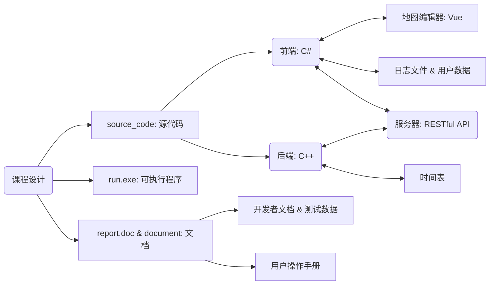

# 3 总体方案设计说明

组员：

| 姓名   | 学号       |
| ------ | ---------- |
| 张梓靖 | 2019211379 |
| 毛子恒 | 2019211397 |
| 姜山   | 2019211402 |

[TOC]

## 3-1 实现方法

- Web开发，采用C/S架构
- 前端编码：Vue（地图编辑器） & C#（模拟导航）
- 后端编码：C++
- 交互：RESTful API
- 文档：Markdown

## 3-2 总体结构



## 3-3 模块划分

### 3-3-1 后端模块划分

- 导入地图数据模块
  - 从服务器存储的`json`格式的文件导入，读取文件流，并构建地图的节点和边等数据结构，初始化地图对象的拥挤度等。

- 查询导航策略路径模块
  - 最短路径策略：通过最短路算法（$Dijkstra$、$A Star / A*$）实现传入起始节点和终止接点，返回一条距离最短的路径。
  
- 最短时间策略：与最短路径策略类似，新加入了**拥挤度**的概念，由于$速度 \times 时间 = 路程 $，也即$ 时间 = \frac{路程}{速度} $，故可以用现有的路程和速度直接求出时间。</br>拥挤度是在地图初始化的时候随机赋值的，所以不妨直接初始化为速度的倒数，从而变为路程的系数。从而每条路径的距离乘系数可得到当前的时间距离（即用经过路径所花费的时间来表示的距离）。可以直接使用最短路径策略的算法，或者针对其不符合欧式二维向量空间的特性加以改进。
  - 途径最短距离策略：仍旧可以转化为最短路径策略，在起始节点与终止节点直接加入途径节点，即可形成起始节点到途径节点、途径节点到终止节点两条最短路径。
  - 交通工具的最短路径策略：在自行车道已经在地图上确定的情况下，采用与最短时间策略类似的方法，对当前所有边的时间距离进行重新计算。

- 获取导航路径预计时间模块

  - 存储不同交通工具的时间表

  - 设计子图内部和跨子图的不同情况，分别有以下几种情况：

    ```json
    {
        "Default": 0,
        "Bicycle": 1,
        "Car": 2,
        "Bus": 4, // 用于跨校区
        "Subway": 8, // 用于跨校区
        "EnterBuilding": 16, // 用于主图到建筑内，建筑内之间
        "ExitBuilding": 32, // 用于主图到建筑内，建筑内之间
        "DownStair": 64, // 用于主图到建筑内，建筑内之间
        "UpStair": 128 // 用于主图到建筑内，建筑内之间
    }
    ```

  - 根据不同情况，计算导航路径预计时间

- 查询周边建筑模块
  - 对周边一定距离范围的节点进行搜索，并返回当前查询结果

- RESTful API
  - 使用`restbed`编码RESTful规范的接口，将导航查询结果通过`json`格式返回给前端

### 3-3-2 前端模块划分

- 地图编辑器模块
  - 实现从键盘和鼠标读入，在地图上标记的功能
    - 标记的节点和边可以修改和删除
    - 分配给节点`id`值，采用递增式的`snowflake`雪花算法实现，得到19位`id`数字字符串
    - 用不同颜色区分不同边的类型，如：普通道路、自行车道等
  - 实现存入`json`格式的地图数据，批量导入节点和边
  - 实现导出`json`格式的地图数据，并可存入缓存和清空缓存
  - 实现通过更改`localStorage`中背景图片url，修改标注地图
- 绘制建筑内部模块
  - 实现点击建筑物进入内部的功能，并可以绘制建筑物内部地图
- 导航策略模块：
  - 实现四种不同导航策略的查询
  - 实现逻辑地址（可建筑物内部）的查询
  - 实现周围建筑物的查询
- 多用户模块
  - 实现用户界面
  - 实现用户信息存储
  - 实现用户逻辑时间表（课程表）存储和读取
- 逻辑位置存储和查询模块
  - 导入逻辑位置数据（课程表）
  - 实现逻辑位置查询，实现逻辑位置间导航
- 查询周边位置模块
  - 在导航系统暂停后，按照输入的范围搜索
  - 排序显示范围内的子图内部节点
- 计时器模块
  - 实现计时器模块，显示当前时间（精确到分钟）
  - 动态显示用户在地图上所在位置
  - 实现随时暂停，并可进行后续操作的功能

- 食堂负载均衡
  - 根据食堂当前人数比例，实现动态负载均衡算法，显示排序后结果。