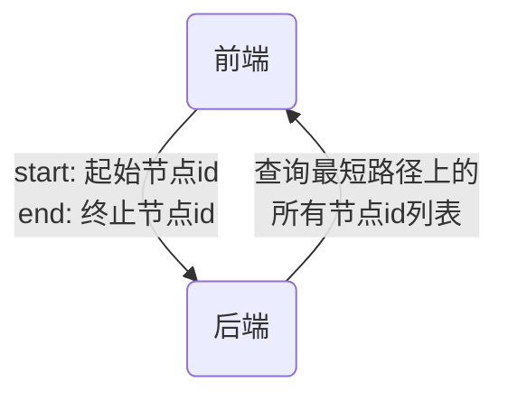

# 4 数据结构说明和数据字典

组员：

| 姓名   | 学号       |
| ------ | ---------- |
| 张梓靖 | 2019211379 |
| 毛子恒 | 2019211397 |
| 姜山   | 2019211402 |

[TOC]

## 4-1 数据结构说明

- 二维向量`Vector2D`

  | 成员 | 变量类型 | 意义           |
  | ---- | -------- | -------------- |
  | `X`  | `int`    | 二维向量横坐标 |
  | `Y`  | `int`    | 二维向量纵坐标 |

- 地图的抽象节点`Node`

  | 成员        | 变量类型             | 意义           |
  | ----------- | -------------------- | -------------- |
  | `id`        | `unsigned long long` | 节点的唯一id值 |
  | `getType()` | 函数返回值`bool`     | 获取节点类型   |

- 地图的内部节点`MapNode`

  | 成员        | 变量类型         | 意义                            |
  | ----------- | ---------------- | ------------------------------- |
  | `mapId`     | `int`            | 节点的唯一id值                  |
  | `name`      | `string`         | 节点的命名                      |
  | `position`  | `Vector2D`       | 节点的坐标，以二维向量形式储存  |
  | `speed`     | `int`            | 节点的速度                      |
  | `getType()` | 函数返回值`bool` | 获取节点类型`true`代表`MapNode` |

- 地图的边界节点`PortNode`

  | 成员        | 变量类型             | 意义                              |
  | ----------- | -------------------- | --------------------------------- |
  | `level`     | `int`                | 节点级别                          |
  | `stMapId`   | `unsigned long long` | 起始点的`MapId`                   |
  | `edMapId`   | `unsigned long long` | 终止点的`MapId`                   |
  | `stNodeId`  | `unsigned long long` | 起始点的`NodeId`                  |
  | `edNodeId`  | `unsigned long long` | 终止点的`NodeId`                  |
  | `getType()` | 函数返回值`bool`     | 获取节点类型`false`代表`PortNode` |
  
- 地图的边`EdgeNode`

  | 成员     | 变量类型             | 意义                 |
  | -------- | -------------------- | -------------------- |
  | `id`     | `unsigned long long` | 边的唯一id值         |
  | `start`  | `int`                | 边的起始点           |
  | `dest`   | `int`                | 边的终止点           |
  | `length` | `int`                | 边的权，代表路径长度 |
  | `speed`  | `int`                | 边的速度             |
  | `level`  | `int`                | 边的级别             |

## 4-2 类对象说明

- 地图类`Graph`私有成员变量

  | 成员           | 变量类型                   | 意义                               |
  | -------------- | -------------------------- | ---------------------------------- |
  | `vertex_count` | `int`                      | 地图总的节点个数                   |
  | `nodes`        | `vector<MapNode>`          | 地图的所有内部节点                 |
  | `edges`        | `vector<vector<EdgeNode>>` | 地图的所有边，以**邻接表**形式储存 |
  | `ports`        | `vector<PortNode>`         | 地图的所有边界节点                 |
  | `scale`        | `double`                   | 缩放比例                           |
  | `lastTime`     | `int`                      | 上一次随机速度的时间               |
  | `avgSpeed`     | `int`                      | 平均速度                           |

- 地图类`Graph`公共成员函数

  | 成员                                                         | 函数功能                           |
  | ------------------------------------------------------------ | ---------------------------------- |
  | `void loadMap(int nodeNum, const std::vector<MapNode> &nodeData, const std::vector<EdgeData> &edgeData)` | 预加载地图内部节点                 |
  | `void loadPort(const std::vector<PortNode> &portData, double scale)` | 预加载地图边界节点                 |
  | `const std::vector<MapNode> &getNodes() const`               | 获取所有节点                       |
  | `const std::vector<std::vector<EdgeNode>> &getEdges() const` | 获取所有边                         |
  | `int getDis(const Vector2D &u, const Vector2D &v) const`     | 获取两点间欧氏距离                 |
  | `void setSpeed(int time)`                                    | 用时间种子随机化速度（**拥挤度**） |
  | `int dijkstra(int st, int ed, Path &solution, bool isRandom, bool isBike) const` | 迪杰斯特拉最短路算法               |

## 4-3 文件数据结构说明

- 地图子图和边界节点文件`port.json`

  ```json
  {
      "maps": [
          {
              "id": 0,
              "scale": 1.0,
              "name": "校区 0",
              "path": "map_0.json",// 路径文件
              "bgimg": "map_0.png" // 背景图片
          }
      ],
      "ports": [
          {
              "id": 1,
              "level": 12,
              "sourceMapId": 1,			   // 起点所在子图id
              "targetMapId": 0,			   // 终点所在子图id
              "sourceNodeId": 1621873253982, // 起点id
              "targetNodeId": 1621872829538  // 终点id
          }
      ]
  }
  ```

- 地图内部节点和边文件`map.json`等（由地图编辑器生成）

  ```json
  {
      "elements": {
          "nodes": [
              {
                  "data": {
                      "id": 1621872829538,
                      "title": "东1门",
                      "subtitle": ""
                  },
                  "position": {
                      "x": 585.3797361211376,
                      "y": 53.04161691813325
                  },
                  "group": "nodes",
                  "removed": false,
                  "selected": false,
                  "selectable": true,
                  "locked": false,
                  "grabbable": true,
                  "pannable": false,
                  "classes": ""
              }
          ],
          "edges": [
              {
                  "data": {
                      "id": 1622026312362,
                      "source": 1622026312276,
                      "target": 1622026312277,
                      "level": 1,
                      "virtual": 0
                  },
                  "group": "edges",
                  "removed": false,
                  "selected": false,
                  "selectable": true,
                  "locked": false,
                  "grabbable": true,
                  "pannable": true,
                  "classes": ""
              }
          ]
      }
  }
  ```
  
- 用户数据文件`user.json`

  ```json
  {
      "zzj": {
          "Username": "zzj", // 用户名
          "Password": "111111", // 密码
          "AddressMapper": { // 逻辑地址列表（课程表）
              "List": [
                  {
                      "DayOfWeek": [ // 周二
                          2
                      ],
                      "TimeStart": 28800, // 上课开始时间
                      "TimeEnd": 34500, // 上课结束时间
                      "Class": "2019211308", // 班级
                      "Activity": "计算机网络", // 课程名
                      "_MapId": 2, // 子图id
                      "_NodeId": 1622021008611 // 节点id
                  },
                  {
                      "DayOfWeek": [
                          3
                      ],
                      "TimeStart": 28800,
                      "TimeEnd": 34500,
                      "Class": "2019211308",
                      "Activity": "数据结构",
                      "_MapId": 2,
                      "_NodeId": 1622021008612
                  }
              ]
          }
      }
  }
  ```

- 日志文件`.log`

  - 进入程序

  ```
  2021-06-03 16:37:33.524 +08:00 [INF] Entering program...
  ```

  - 选点

  ```
  2021-06-03 16:41:47.926 +08:00 [DBG] Click on Point(468,245.56) id = 1621873253990
  ```

  - 打开子图（教学楼内部）

  ```
  2021-06-03 17:51:08.695 +08:00 [INF] Open Map 2
  ```

  - 开始导航

  ```
  2021-06-04 07:27:26.553 +08:00 [INF] Finding Path from: Node(Id = 1621873253984, MapId = 1, Location = 650, 316, Title = null), to: Node(Id = 1622021008611, MapId = 2, Location = 198, 330, Title = B2F1 教室-2)
  ```

  - 模拟开始

  ```
  2021-06-04 12:33:28.636 +08:00 [INF] Start simulation.
  ```

  - 模拟结束

  ```
  2021-06-04 12:33:04.204 +08:00 [INF] Finish simulation.
  ```

  - 输出当前位置到日志

  ```
  2021-06-04 12:33:28.656 +08:00 [INF] Current location: (507.88774178974234, 364.72179487023107)
  ```

## 4-4 接口说明

RESTful接口举例图示：



**注**：以下接口说明格式

`[GET] /xxx?p1=v1` 表示请求方法 `[GET]`，路径 `/xxx`，参数 `p1` 值为 `v1`

- ` [GET] /map_meta` 获取地图元数据

  返回格式：

```json
{
    "maps": [
        0,
        1,
        2,
        3
    ],
    "ports": [
        {
            "id": 1,
            "level": 12, // Subway + Bus = 4 + 8 = 12
            "sourceMapId": 0,
            "targetMapId": 1,
            "sourceNodeId": 1621873253982,
            "targetNodeId": 1621872829538
        },
        {
            "id": 2,
            "level": 12,
            "sourceMapId": 1,
            "targetMapId": 0,
            "sourceNodeId": 1621872829538,
            "targetNodeId": 1621873253982
        }
    ]
}
```

- `[GET] /map/:id` 获取地图数据

  返回格式：

```json
{
    "elements": {
        "nodes": [ // 节点数据结构
            {
                "data": {
                    "id": "6802523324657176576",
                    "title": "", // 节点名
                    "subtitle": ""
                },
                "position": { // 节点坐标，以像素为单位
                    "x": 144,
                    "y": 483
                },
            }
        ],
        "edges": [ // 边数据结构
            {
                "data": {
                    "id": "6802523515032440832",
                    "source": "6802523392281939968", // 起点id
                    "target": "6802523482799214592", // 终点id
                    "level": 0 // 级别（也可理解为类型）
                }
                "group": "edges", // 以下是不重要的系统生成项
                "removed": false,
                "selected": true,
                "selectable": true,
                "locked": false,
                "grabbable": true,
                "pannable": true,
                "classes": ""
            }
        ]
    }
}
```

 * `[GET] /path?`

     *   source_node_id = xxx
     * target_node_id = xxx
     * source_map_id = xxx
     * target_mop_id = xxx
    * type = 1               // 路径规划类型 1 最短距离 2 最短时间 3 自行车最短时间

    - depart_at = 1231

    - cross_type = 1         // 如果跨校区，选择通勤类型 1 班车 2 公交车 3 出租车

    获取路径
 ```json
{
    "id": 1, //schemeId，只在通过方式涉及地铁和校车时会返回数组
    "time": 89,
    "path": [
        {
            "type": "node",
            "id": 123,
            "mapId": 1,
        },
        {
            "type": "node",
            "id": 124,
            "mapId": 1,
        },
        {
            "type": "port",
            "id": 123
        },
        {
            "type": "node",
            "id": 333,
            "mapId": 2,
        },
    ]
}

 ```

- `[GET]/setgraphnum`

  setmap之前先设置这个

  - num 子图数量

- ` [POST]/setmap`
  - area 表示几号子图
  - elements/nodes，一个列表存放节点信息
    - data/title 物理地址
    - data/subtitle用作逻辑地址，逻辑地址字符串解析出来应当是一个列表，列表中的每个元素是一个二元组，分别为地址名字和楼层（如果不是教学楼楼层设为0），这是由于一个点可能对应多个楼层的逻辑地址
    - data/id id
    - position/x position/y 位置
  - elements/edges，一个列表存放边信息
    - /data/source 起点id
    - /data/target 终点id
    - /data/level 为1时表示自行车禁行
    - /data/id 边id

  一般来说十字路口之类没有实际意义的点，title值留空

  名为“出口x”的物理地址会被解析成通向x子图的出口

  名为“楼梯”的物理地址会被解析成楼梯特殊点，在这个点会发生楼层的变更

  出口点和楼梯点必须是悬挂点（即入度和出度都为1）

- `[GET]/getmap`

  area 几号子图

- `[POST]/getloc`

    - name 地址
    - type "phy" 物理地址 "log"是逻辑地址

    返回值为一个列表，列表中的元素：

    - id 点id
    - floor 点的层数

    如果查询逻辑地址，则列表中只有一个元素

- `[GET]/getpath`

    - st 起始地点ID
    - startarea 起始地点所属的子图编号
    - startfloor 起点楼层
    - end 终止地点ID
    - endarea 终止地点所属的子图编号
    - endfloor 终点楼层
    - type 路径规划类型 1 最短距离 2 最短时间 3 自行车最短时间
    - time 小时分钟，四位数字表示
    - crosstype 如果跨校区，选择通勤类型 1 班车 2 公交车 3 出租车

    返回格式：

    - time 路径走完需要几分钟
    - crosstime 如果跨校区（0到1或者1到0），则是一个整数表示跨校区要几分钟
    - path 一个列表，列表中的元素：
      - id 路径id
      - edges 边id的列表
      - speed 速度的列表，整数

- `[GET]/getnext`

    - id 路径ID

    返回格式：

    - x x坐标
    - y y坐标
    - floor 层数
    
    当走到终点时，返回0，0，0
    
- `[GET]/getclose`

    - area 子图
    - x
    - y 坐标
    - dis 距离范围

    像素和公制单位的转换关系未确定，这里距离暂时按像素计

    返回值为一个列表，从近到远排列每个点：

    - id id
    - dis 距离

    只会返回物理地址不为空的节点

---

Level Flags转换方法：

 `f & o == f `表示存在改值

```js
var flags = Enum.GetValues(typeof(Status))
                .Cast<int>()
                .Where(f=> f & o == f)
                .ToList();

One gotcha with this approach is that it will include aggregate enumeration values. For example:

[Flags]
public enum Status
{
    None = 0,
    One = 1,
    Two = 2,
    All = One | Two,
}
```

使用 | 来标记 bit

例如 Bicycle + Car = 3 = 0000 0011（注：默认是 Default，用于标记常规道路）

```json
{
    "Default": 0,
    "Bicycle": 1,
    "Car": 2,
    "Bus": 4, // 用于跨校区
    "Subway": 8, // 用于跨校区
    "EnterBuilding": 16, // 用于主图到建筑内，建筑内之间
    "ExitBuilding": 32, // 用于主图到建筑内，建筑内之间
    "DownStair": 64, // 用于主图到建筑内，建筑内之间
    "UpStair": 128 // 用于主图到建筑内，建筑内之间
}
```
