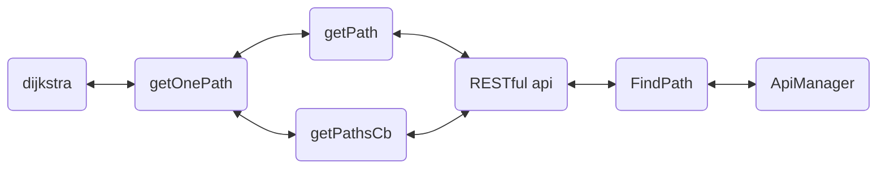

# 5 各模块设计说明

## 5-1 算法思想

- **基本思想**：

  - 指定起点 $s$，即从顶点 $s$ 开始计算。

  - 引进两个集合 $S$ 和 $U$ 。

  $S$ ：记录已求出最短路径的顶点（以及相应的最短路径长度）。

  $U$ ：记录还未求出最短路径的顶点（以及该顶点到起点$s$的距离）。

- **算法步骤**：
  1. 初始时，$S$ 只包含起点 $s$ ；$U$ 包含除 $s$ 外的其他顶点，且 $U$ 中顶点的距离为**起点 $s$ 到该顶点的距离**。例如，$U$ 中顶点 $v$ 的距离为 $(s,v)$ 的长度，然后 $s$ 和 $v$ 不相邻，则 $v$ 的距离为 $\infin$。
  2. 从 $U$ 中选出**距离最短的顶点 $k$ **，并将顶点 $k$ 加入到 $S$ 中；同时，从 $U$ 中移除顶点 $k$ 。
  3. 更新 $U$ 中各个顶点到起点 $s$ 的距离。之所以更新 $U$ 中顶点的距离，是由于上一步中确定了 $k$ 是求出最短路径的顶点，从而可以利用 $k$ 来更新其它顶点的距离；例如， $(s,v)$ 的距离可能大于 $(s,k)+(k,v)$ 的距离。
  4. 重复步骤 2 和 3 ，直到遍历完所有顶点。

## 5-2 算法

### 5-2-1 Dijkstra

- 最初的$Dijkstra$算法不采用优先队列，时间复杂度是$O(n^3)$。

  这是因为在每次从为求出最短路径的定点集合中取出距离虽短的顶点，都需要遍历一遍与其相邻的顶点，时间复杂度为$O(n)$。

- 通过优先队列（堆）实现的$Dijkstra$算法时间复杂度是$O(n^2 \log n)$。

  改进之处正是由于优先队列（堆）只需要从堆顶取出距离最小的顶点即可，获取堆顶元素的时间复杂度为$O(1)$，堆顶元素移除后，维护堆的时间复杂度为$O(\log{n})$，故时间复杂度整体优化至$O(n^2\log{n})$。

```cpp
void Graph::dijkstra(int st, int ed, Path &solution) const
{
    priority_queue<pair<int, int>, vector<pair<int, int>>, greater<pair<int, int>>> q;
    unique_ptr<int[]> dis(new int[vertexCount]);
    unique_ptr<int[]> lastVertex(new int[vertexCount]);
    for (int i = 0; i < vertexCount; ++i)
    {
        dis[i] = INF;
        lastVertex[i] = -1;
    }
    dis[st] = 0;
    q.push(make_pair(0, st));
    while (!q.empty())
    {
        int u = q.top().second;
        q.pop();
        for (auto edge:edges[u])
        {
            if (dis[edge.dest] > dis[u] + edge.length)
            {
                dis[edge.dest] = dis[u] + edge.length;
                lastVertex[edge.dest] = u;
                q.push(make_pair(dis[edge.dest], edge.dest));
            }
        }
    }
    int temp = ed;
    while (~temp)
    {
        solution.push_back(nodes[temp]);
        temp = lastVertex[temp];
    }
    reverse(solution.begin(), solution.end());
}
```

### 5-2-2 A Star（A*）

$A*$算法（$A Star$）算法是一种静态路网中求解最短路最有效的方法，可以看做是$Dijkstra$算法的优化。

公式表示为：$f(n)=g(n)+h(n)$，其中$f(n)$是从初始点经由节点$n$到目标点的估价函数，$g(n)$是在状态空间中从初始节点到$n$节点的实际代价，$h(n)$是从$n$到目标节点最佳路径的估计代价。

```cpp
void Graph::Astar(int st, int ed, Path &solution) const
{
    priority_queue<pair<int, int>, vector<pair<int, int>>, greater<pair<int, int>>> q;
    unique_ptr<int[]> dis(new int[vertexCount]());
    unique_ptr<const EdgeNode * []> lastEdge(new const EdgeNode * [vertexCount]);
    unique_ptr<bool[]> inOpen(new bool[vertexCount]());
    unique_ptr<bool[]> inClose(new bool[vertexCount]());
    for (int i = 0; i < vertexCount; ++i)
    {
        lastEdge[i] = nullptr;
        inOpen[i] = inClose[i] = false;
    }
    inOpen[st] = true;
    q.push(make_pair(cal_distance(nodes[st], nodes[ed]), st));
    while (!q.empty())
    {
        auto u = q.top().second;
        if (u == ed)break;
        q.pop();
        if (inClose[u])continue;
        inClose[u] = true;
        for (const auto &edge:edges[u])
        {
            if (inClose[edge.dest])continue;
            if (!inOpen[edge.dest])
            {
                dis[edge.dest] = dis[u] + edge.length;
                lastEdge[edge.dest] = &edge;
                q.push(make_pair(dis[edge.dest] + cal_distance(nodes[edge.dest], nodes[ed]), edge.dest));
                inOpen[edge.dest] = true;
            }
            else
            {
                if (dis[edge.dest] > dis[u] + edge.length)
                {
                    dis[edge.dest] = dis[u] + edge.length;
                    lastEdge[edge.dest] = &edge;
                    q.push(make_pair(dis[edge.dest] + cal_distance(nodes[edge.dest], nodes[ed]), edge.dest));
                }
            }
        }
    }
    while (lastEdge[ed])
    {
        solution.push_back(lastEdge[ed]->id);
        ed = lastEdge[ed]->start;
    }
    reverse(solution.begin(), solution.end());
}
```

## 5-3 特点

1. $Dijkstra$算法计算源点到其他所有点的最短路径长度，$A*$关注点到点的最短路径(包括具体路径)。 
2. $Dijkstra$算法建立在较为抽象的图论层面，$A*$算法可以更轻松地用在诸如游戏地图寻路中。 
3. $Dijkstra$算法的实质是广度优先搜索，是一种发散式的搜索，所以空间复杂度和时间复杂度都比较高。对路径上的当前点，$A*$算法不但记录其到源点的代价，还计算当前点到目标点的期望代价，是一种启发式算法，也可以认为是一种深度优先的算法。 
4. 由第一点，当目标点很多时，$A*$算法会带入大量重复数据和复杂的估价函数，所以如果不要求获得具体路径而只比较路径长度时，$Dijkstra$算法会成为更好的选择。 
5. **最重要**的一点，这也是我们后来不采用$A*$算法反而采用$Dijkstra$算法的原因！采用欧氏距离作为预估函数的$A*$算法不适用于非欧平面！如果是求最短路径问题，$A*$算法无疑是可行的；但是在最短时间问题上不可行，因为地图拥挤度是随机的，并且还有步行和自行车之分，我们不能保证通过路径的时间能代替路径的距离作为边权，还能够形成一个非欧平面。如果不能保证是非欧平面，那么$A*$算法在某些情况下，预估函数将引起极大的误导作用，产生的结果将会是错误的。而堆优化$Dijkstra$算法虽然在某些时候效率不如$A*$算法，但结果总是正确的。在效率和正确性的抉择中，我们最终还是选择了算法的正确性。

## 5-4 与其他模块的关系



